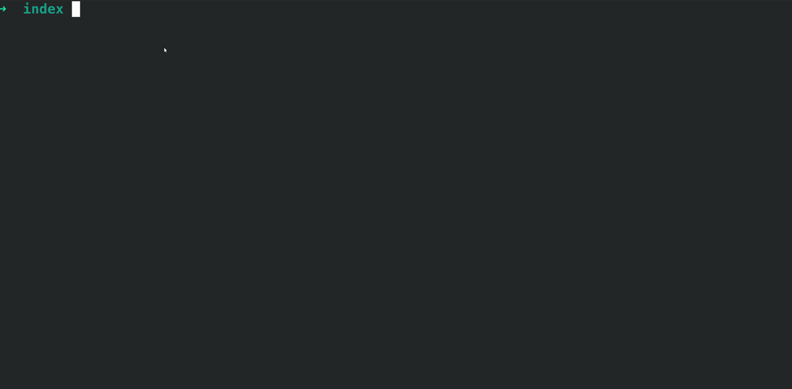
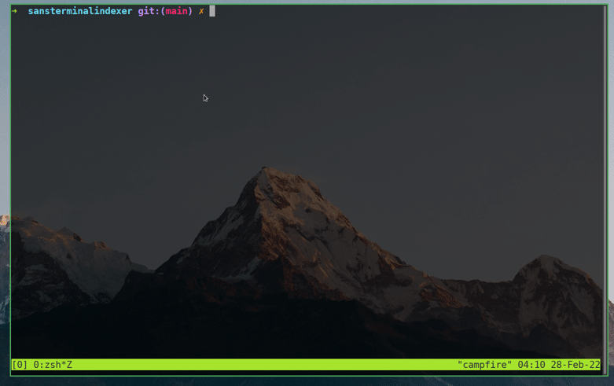
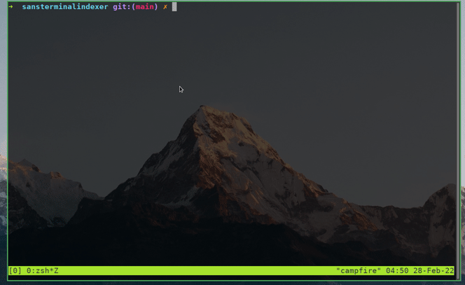

# Sans Terminal Indexer
This is a program currently in development that I am creating to help make indexing of SANS textbooks easier that is based off of [Voltaire](https://voltaire.publickey.io/). 

Currently the indexer has the following features
- Checks to see if you have any indexes in the current directory (Checks for .csv files)
    - If so it will ask you to select which index you would like to use, if not it will create a new one.
- Takes input in the format of **Term, definition, page number**. The three fields can be any an information you want in your index but it must be delimited by commas.
- You index is saved in the directory the program is launched from everytime you enter a new entry

# This is still a work in progress.

# Todo
- ~~Add index viewer within program (Pretty print index.csv)~~

- Add edit feature (edit previous index entries)
- Add CSV sorting (Sort by book then alphabetical)
- Add handling for repeat entries
- Only show CSVs when asking which index you want to work on
- ~~Add "Create new" option to csv selection option~~

- Create a .sansindex file in home directory that stores indexes
- Add delete option for index files
- Add "ask for book" prompt on startup
- Allow for input with no definition (term, pagenumber)
